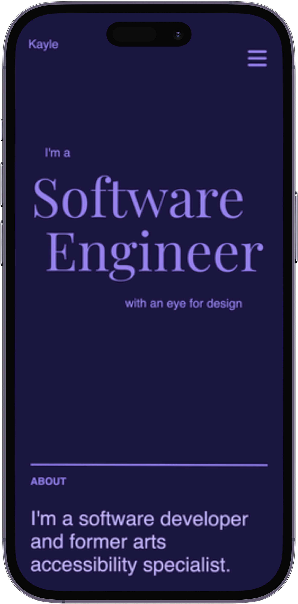
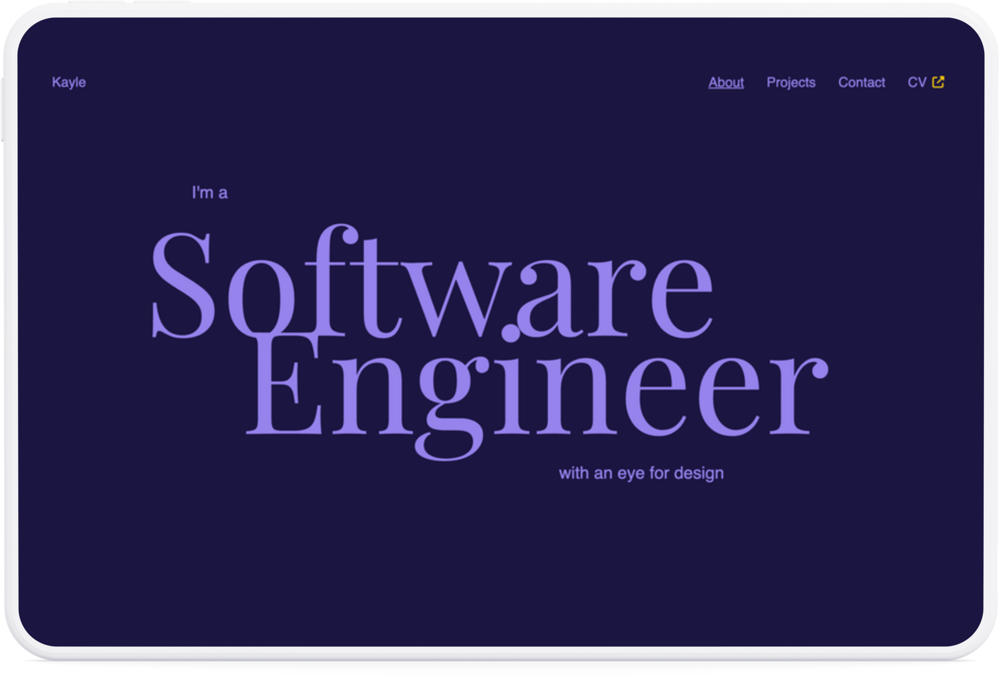

# [Kayle's Portfolio](https://kayleriegerpatton.github.io/portfolio/)

## Description

This single page application highlights some of my work and projects, a bit about me, my contact information, and a link to my live CV.

The app leverages React, custom CSS, and FontAwesome icons to deliver a streamlined and responsive interface. In addition to manually setting up the project's configuration for linting, bundling, and transpiling, I also enjoyed deepening my knowledge of React Testing Library and accessibility foundations, plus the challenge of implementing a few features with vanilla JS rather than external libraries.

My portfolio is currently deployed with GitHub Pages.
Check it out here: [https://kayleriegerpatton.github.io/portfolio/](https://kayleriegerpatton.github.io/portfolio/)

### Technologies

## Screenshots

| Mobile                                                | Tablet                                                |
| ----------------------------------------------------- | ----------------------------------------------------- |
|  |  |

## Future Work

Here are some additional features I'd love to find time to explore and add:

- An image comparison slider for before-and-afters
- Trying out SCSS
- Routing some additional pages which go into further detail about certain projects
- Integrating some accessibility testing tools, such as axe DevTools
- Adding a 'Specialties' section to highlight my top skills and software engineering interests  
- ✅ Adding a 'Social Proof'/'Testimonials' type section to quote some lovely things people have said about my work

## License

MIT License
